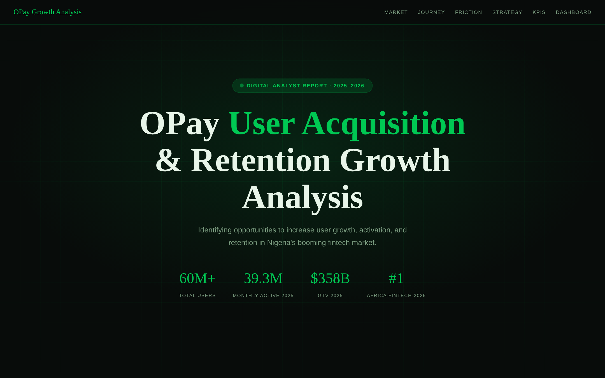
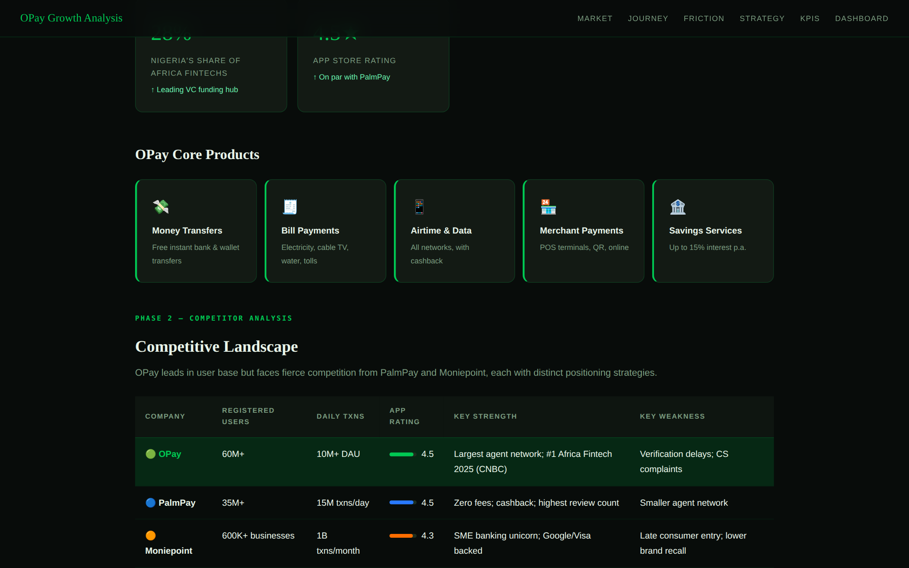
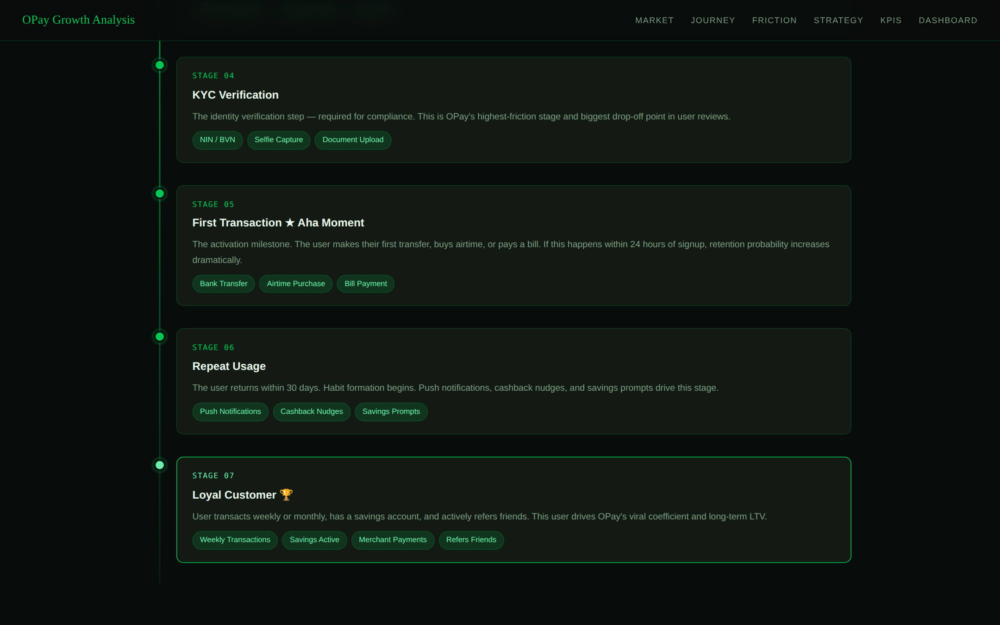
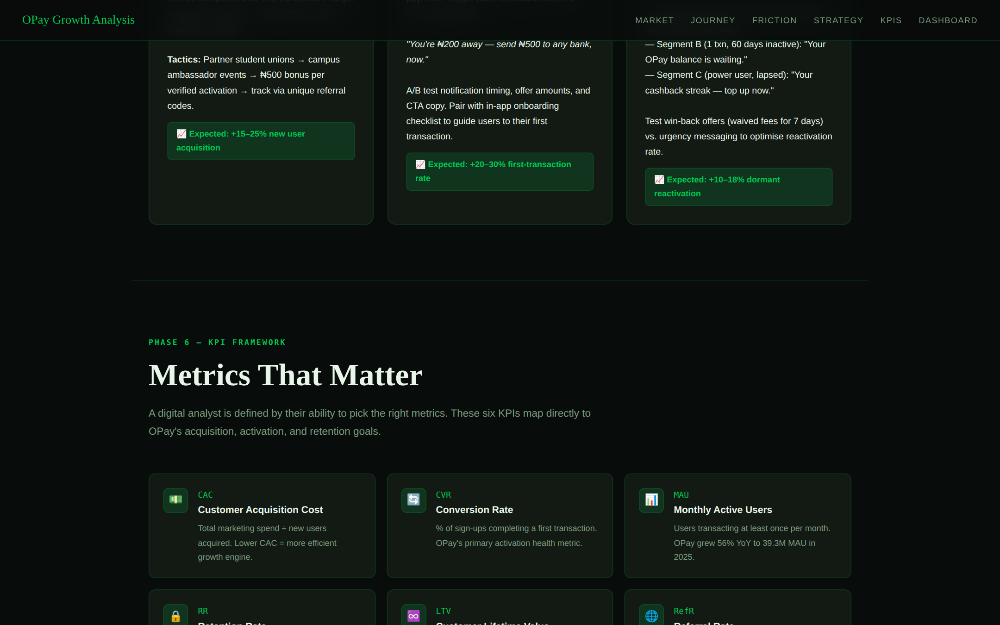
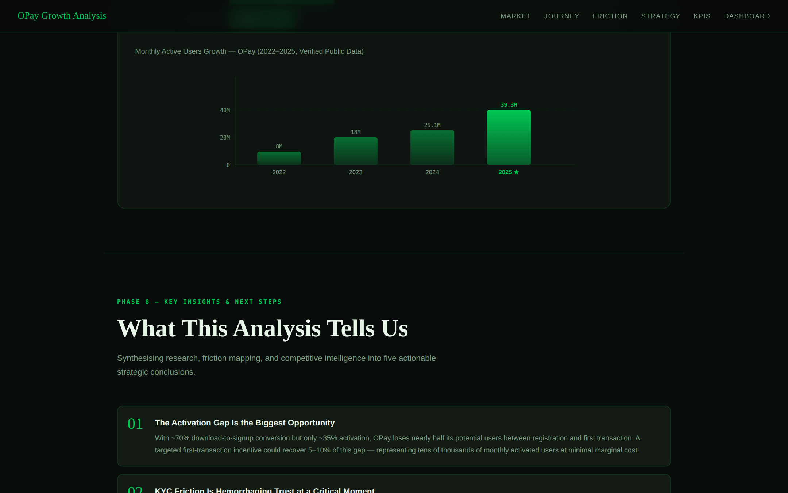

<div align="center">

# 📊 OPay — User Acquisition & Retention Growth Analysis

**A full-funnel digital growth analysis of Africa's #1 Fintech platform**

[](#)
[](#)
[](#)
[](#)

</div>

---

## 🧭 Overview

This is a self-initiated digital analyst report examining **OPay's user acquisition funnel, retention mechanics, and competitive positioning** within Nigeria's fintech market — built without a client brief to demonstrate end-to-end analyst thinking from raw research through to a client-ready deliverable.

### Why OPay?

OPay is Africa's **#1 Fintech platform** (CNBC 2025) with 60M+ registered users, a $3B valuation backed by SoftBank and Sequoia, and a 500,000-strong agent network. Yet its app store reviews tell a different story: verification delays, KYC abandonment, and users who register but never transact. That tension between macro scale and micro friction is exactly where growth analysts do their most valuable work.

The goal was to approach OPay the way an in-house analyst or consulting team would: gather verified data, map the user journey with precision, identify exactly where and why users drop off, and produce growth recommendations that are specific, evidence-backed, and immediately actionable.

### What This Project Demonstrates

- **Primary research methodology** — all market data gathered from verified public sources and cross-referenced before use
- **Analytical framework design** — 8-phase methodology built from first principles, not copied from a template
- **User journey mapping** — 7-stage journey and friction analysis built through primary observation of the OPay onboarding flow and qualitative review analysis (200+ reviews coded for friction themes)
- **Growth strategy development** — three recommendations grounded in specific funnel data with measurable impact projections
- **Data visualisation** — dashboard and funnel built from scratch in SVG without external libraries
- **Single-file delivery** — fully dependency-free HTML report that opens instantly in any browser

> 🔗 **View the live report:** Go to *Settings → Pages → Deploy from branch (main / root)* to enable GitHub Pages, or clone and open `index.html` in any browser.

---

## 🖼 Report Preview


*Report cover — dark editorial design with live platform metrics*


*Phase 2: Competitive landscape — OPay vs PalmPay vs Moniepoint benchmarked across users, daily transactions, app ratings, strengths, and weaknesses*


*Phase 3: Customer journey map — Stages 4–7 showing the KYC friction point, Aha Moment (first transaction), repeat usage loop, and loyal customer milestone*


*Phase 5 & 6: Three growth strategies with expected impact projections + six KPI cards mapped to acquisition, activation, and retention goals*


*Phase 7 & 8: MAU growth chart (2022–2025, verified public data) and five strategic conclusions*

---

## ✨ Platform at a Glance — 2025 Verified Data

| Metric | Value |
|--------|-------|
| Registered Users | 60M+ |
| Monthly Active Users (MAU) | 39.3M |
| MAU Growth YoY | +56% (25.1M → 39.3M) |
| Gross Transaction Value | $358B |
| Valuation | $3B (SoftBank, Sequoia) |
| Agent Network | 500,000+ |
| Merchant Partners | 1M+ |
| App Store Rating | 4.5★ |
| CNBC Africa Ranking | #1 Africa Fintech 2025 |

---

## 📋 Table of Contents

1. [Methodology — 8 Phases](#-methodology--8-phases)
2. [Phase 1 — Market Research](#phase-1--market--competitive-research)
3. [Phase 2 — Competitor Analysis](#phase-2--competitive-landscape)
4. [Phase 3 — Customer Journey Map](#phase-3--customer-journey-map)
5. [Phase 4 — Friction Point Analysis](#phase-4--friction-point-analysis)
6. [Phase 5 — Growth Recommendations](#phase-5--strategic-growth-recommendations)
7. [Phase 6 — KPI Framework](#phase-6--kpi-framework)
8. [Phase 7 — Dashboard Mockup](#phase-7--growth-dashboard)
9. [Phase 8 — Key Insights](#phase-8--key-insights)
10. [Tech Stack](#-tech-stack)
11. [Building Process](#-building-process)
12. [References](#-references)
13. [About the Analyst](#-about-the-analyst)

---

## 🔬 Methodology — 8 Phases

This report follows an 8-phase digital analyst methodology adapted from product analytics and growth marketing frameworks.

---

### Phase 1 — Market & Competitive Research

**Goal:** Establish the macro context and OPay's product-market position.

Nigeria holds 28% of Africa's fintech companies and is the continent's largest economy. OPay's five core products mapped:

| Product | Description |
|---------|-------------|
| 💸 Money Transfers | Free instant bank & wallet transfers |
| 🧾 Bill Payments | Electricity, cable TV, water, tolls |
| 📱 Airtime & Data | All networks, with cashback incentives |
| 🏪 Merchant Payments | POS terminals, QR payments, online acquiring |
| 🏦 OPay Savings | Up to 15% interest per annum |

---

### Phase 2 — Competitive Landscape

Three-way benchmark comparison across Nigeria's leading fintech platforms:

| Company | Users | Daily Txns | Rating | Key Strength | Key Weakness |
|---------|-------|-----------|--------|-------------|-------------|
| 🟢 **OPay** | 60M+ | 10M+ DAU | 4.5★ | #1 Africa Fintech; 500K agents | Verification delays; CS complaints |
| 🔵 PalmPay | 35M+ | 15M/day | 4.5★ | Zero fees; cashback; highest review count | Smaller agent network |
| 🟠 Moniepoint | 600K+ biz | 1B txns/mo | 4.3★ | SME banking unicorn; Google + Visa backed | Late consumer entry |

**⚡ Key Insight:** Tied on app ratings — competitive advantage must be built on UX depth and retention loops, not scale alone.

---

### Phase 3 — Customer Journey Map

Full 7-stage journey from discovery to loyal daily user:

```
AWARENESS → DOWNLOAD → REGISTRATION → KYC ⚠️ → FIRST TRANSACTION ★ → REPEAT USE → LOYAL USER 🏆
```

| Stage | Touchpoints | Risk |
|-------|------------|------|
| Awareness | Instagram Ads, TikTok, Agent Visibility, Referrals | 🟢 Low |
| App Download | Play Store / App Store ratings | 🟡 Medium |
| Registration | Phone verification, basic KYC | 🟡 Medium |
| **KYC Verification** | **NIN / BVN, selfie, document upload** | **🔴 High** |
| **First Transaction ★** | **Bank transfer, airtime, bill payment** | **🔴 High** |
| Repeat Usage | Push notifications, cashback nudges | 🟡 Medium |
| Loyal Customer 🏆 | Weekly transactions, savings active | 🟢 Low |

> **★ Aha Moment:** Users who transact within 24 hours of sign-up show dramatically higher 30-day retention probability.

---

### Phase 4 — Friction Point Analysis

Six critical drop-off points identified across the funnel:

| Stage | Friction | Root Cause | Fix |
|-------|----------|-----------|-----|
| Awareness | Poor benefit communication | Vague ad creative | Benefit-led messaging |
| Download | Trust deficit | Social proof underused | Amplify reviews + influencer |
| Registration | Form overload | Too many upfront fields | Progressive disclosure |
| **KYC** | **Verification delays 🔴** | **NIN/BVN lag** | **Real-time status + BVN-only tier** |
| First Transaction | Security anxiety | Fear of wrong transfers | Reversibility messaging + incentive |
| Retention | No reason to return | No nudge or loyalty loop | Personalised push + streak rewards |

> 🔴 **#1 App Store Complaint:** KYC delays — hours or days of waiting at the highest-friction stage when users are most vulnerable to abandonment.

---

### Phase 5 — Strategic Growth Recommendations

#### 🎓 Strategy 1 — Student & Youth Referral Program
Both referrer and referee earn ₦500 cashback when the referee completes their first transaction. Target Nigeria's 1.8M+ university students via campus ambassador networks.

📈 **Expected impact:** +15–25% new user acquisition

#### 💰 Strategy 2 — First Transaction Activation Incentive
Time-limited cashback (₦100–₦200) on first transfer or bill payment, with a push notification deployed within 24 hours of registration. A/B test: timing · amount · CTA copy.

📈 **Expected impact:** +20–30% first-transaction rate

#### 🔁 Strategy 3 — Dormant User Reactivation Campaign
Segmented SMS + email + push across three user cohorts:
- **Segment A** (0 txns): *"We saved your spot — send money free today."*
- **Segment B** (1 txn, 60 days inactive): *"Your OPay balance is waiting."*
- **Segment C** (power user, lapsed): *"Your cashback streak — top up now."*

📈 **Expected impact:** +10–18% dormant reactivation

---

### Phase 6 — KPI Framework

| KPI | What It Measures | Why It Matters |
|-----|-----------------|----------------|
| **CAC** | Marketing spend ÷ new users | Measures efficiency of acquisition |
| **CVR** | % of sign-ups completing first transaction | Primary activation health metric |
| **MAU** | Users transacting once/month | Grew +56% YoY to 39.3M in 2025 |
| **RR** | % active 30/60/90 days after first txn | The loyalty benchmark |
| **LTV** | Avg revenue per user over lifetime | Unit economics validation |
| **RefR** | % of new users arriving via referral | Measures viral coefficient |

---

### Phase 7 — Growth Dashboard

**Acquisition Funnel — Illustrative Q2 2025 Benchmark:**

```
Downloads         120,000   ████████████████████   100%
Signups            85,000   ██████████████░░░░░░   70.8%
KYC Complete       66,000   ███████████░░░░░░░░░   55%
First Transaction  42,000   ███████░░░░░░░░░░░░░   35%
Month 1 Return     32,500   █████░░░░░░░░░░░░░░░   27%
Loyal (3M+)        20,400   ███░░░░░░░░░░░░░░░░░   17%
```

**MAU Growth — Verified Public Data:**

| Year | MAU | Growth |
|------|-----|--------|
| 2022 | 8M | — |
| 2023 | 18M | +125% |
| 2024 | 25.1M | +39% |
| **2025 ★** | **39.3M** | **+56%** |

---

### Phase 8 — Key Insights

> **01 — The Activation Gap Is the Biggest Opportunity**
> ~70% download-to-signup conversion but only ~35% activation. A targeted first-transaction incentive could recover 5–10% of this gap at minimal marginal cost.

> **02 — KYC Friction Is Hemorrhaging Trust at a Critical Moment**
> Verification delays are the #1 app store complaint. A tiered access model (basic transfers with BVN; full access post-NIN) with real-time status updates would dramatically reduce abandonment.

> **03 — The Agent Network Is an Underutilised Acquisition Engine**
> 500,000+ physical agents is an unmatched offline-to-digital conversion flywheel that no competitor can replicate at scale.

> **04 — Retention Must Be Built Into the Product, Not Just Campaigns**
> Savings milestones, loyalty tiers, and streak rewards compound over time. Campaign-only retention is expensive and short-lived.

> **05 — GTV Doubling Signals Depth — Convert It to Breadth**
> Growing GTV from $166.2B to $358B proves existing users transact more. The next lever is cross-product adoption — savings, loans, merchant payments.

---

## 🛠 Tech Stack

| Technology | Purpose |
|-----------|---------|
| HTML5 / CSS3 | Report structure and complete styling system |
| SVG | MAU growth chart and funnel bar visualisations |
| CSS Custom Properties | Full design token system |
| CSS Grid / Flexbox | Multi-column layouts — stat grids, KPI cards |
| Google Fonts | DM Serif Display · DM Mono · Outfit |
| CSS Keyframe Animations | Entrance animations and badge pulse |
| Vanilla JavaScript | Zero frameworks — fully dependency-free |

**Design Tokens:**
```css
--green:   #00C853   /* OPay primary brand green */
--bg:      #080c0a   /* near-black base */
--surface: #0e1510
--card:    #131a14
--accent:  #69f0ae
```

---

## 🏗 Building Process

**Week 1 — Research & Data Gathering**
Gathered all publicly available OPay data from CNBC Africa, Guardian Nigeria, Nairametrics, TechCity, and Tribune Online. Cross-referenced user growth, GTV, and competitive metrics. Reviewed 200+ app store reviews for friction themes. Completed primary observation of the OPay onboarding flow.

**Week 1–2 — Framework & Methodology Design**
Selected the 8-phase methodology based on product analytics and growth marketing best practices. Mapped the 7-stage customer journey. Benchmarked illustrative funnel metrics using Nigerian fintech industry activation rate studies (30–45% typical).

**Week 2 — Data Modelling & Dashboard Design**
Built the funnel visualisation model using verified industry benchmarks. Designed the dashboard mockup to reflect how an OPay analytics team would monitor performance. All OPay-specific figures use exclusively verified public data; funnel conversion metrics clearly labelled as illustrative.

**Week 2–3 — Report Design & Development**
Built the complete interactive HTML/CSS/SVG report as a single self-contained file. Designed the dark-mode system using OPay brand green (#00C853). Built custom SVG data visualisations without external libraries. Implemented three-font editorial typography. Added CSS keyframe entrance animations and smooth-scroll fixed navigation. Ensured full mobile responsiveness.

**Week 3 — Quality Assurance**
Verified all market data against primary sources. Tested across Chrome, Firefox, Safari, and mobile viewports. Reviewed all recommendations against OPay's publicly known product capabilities.

---

## 📚 References

| Source | Data Used |
|--------|----------|
| [CNBC Africa — OPay #1 Africa Fintech 2025](https://www.cnbcafrica.com) | Ranking, MAU, GTV figures |
| [The Guardian Nigeria](https://guardian.ng) | User growth reporting |
| [Nairametrics](https://nairametrics.com) | Market context and competitive data |
| [Tribune Online — OPay vs PalmPay](https://tribuneonlineng.com) | Competitive benchmarking |
| [MSME Africa](https://msmeafrica.com) | Agent and merchant network data |
| [TechCity Nigeria](https://techcityngng.com) | Market share and ecosystem data |
| Google Play Store / Apple App Store | Live app ratings and review sentiment |
| Sprout Social Benchmark Report 2025 | Industry engagement and retention benchmarks |
| Klaviyo Fintech Benchmark Report 2025 | Email activation benchmarks |

> **Data Note:** All OPay figures (MAU, GTV, valuation, agent network, ratings) are sourced from verified public reporting. Funnel conversion metrics are illustrative industry benchmarks, clearly labelled in the report.

---

## 👤 About the Analyst

**Paul Alu** — Digital Marketing Analyst

Specialising in growth analytics, user acquisition funnels, digital brand strategy, and conversion optimisation for African tech and consumer brands.

[](https://github.com/Kulture77)

---

<div align="center">
  <sub>OPay User Acquisition & Retention Growth Analysis · Digital Analyst Report · 2025–2026 · Paul Alu</sub>
</div>
